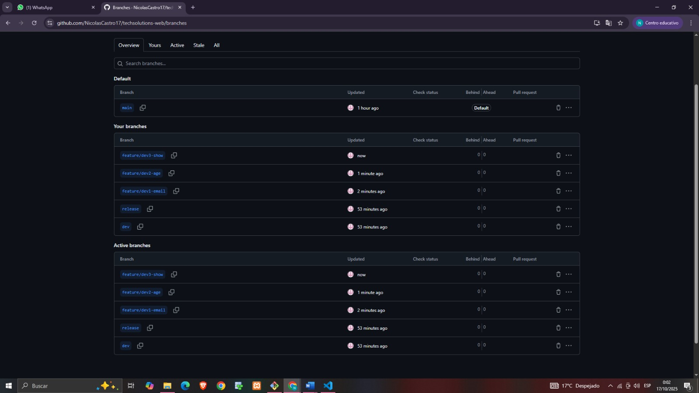
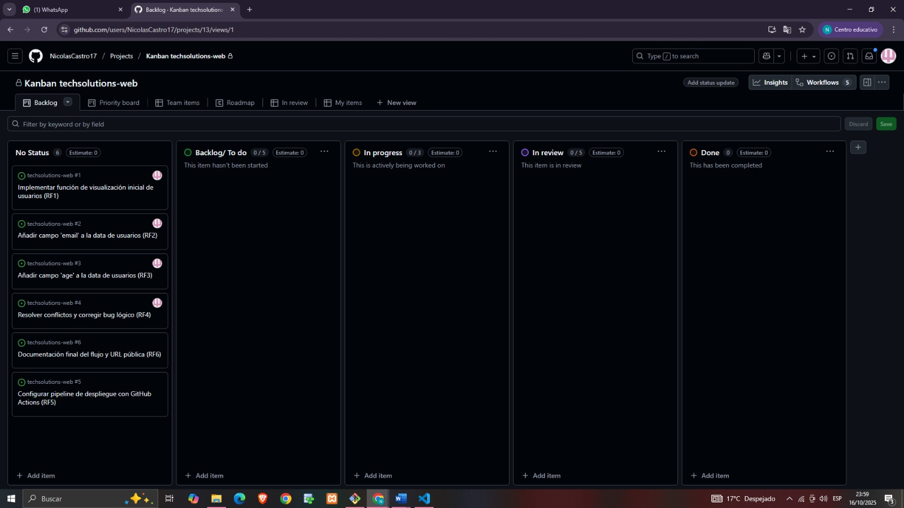
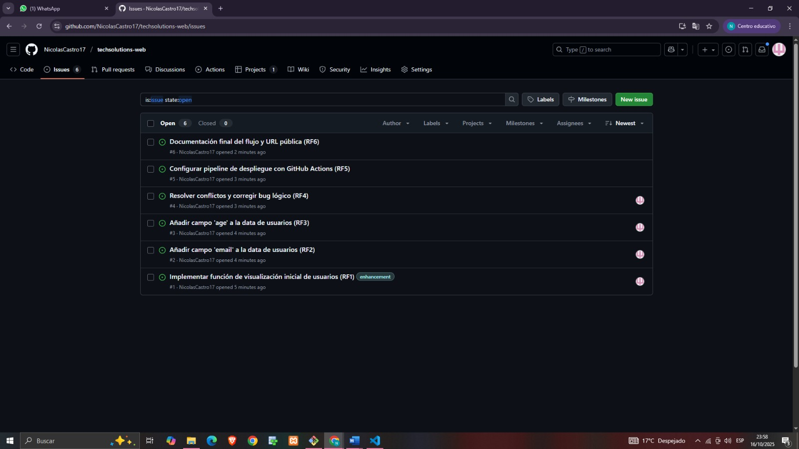

**Configuración inicial:**

**Kanban:**

**Desarrollo de features y generación de conflictos:**

## En esta captura se ve el conflicto generado (en la terminal de git) y la resolución (mergeado)
**Merge a dev y resolución de conflictos:**

**Pipeline de CI/CD completado:**

**Merge a release y despliegue:**

**URL de Despliegue Final:**
La aplicación está disponible en producción en: [https://techsolutions-web2.vercel.app/]

**Merge final a main:**

